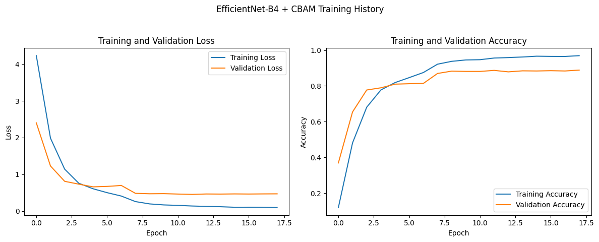
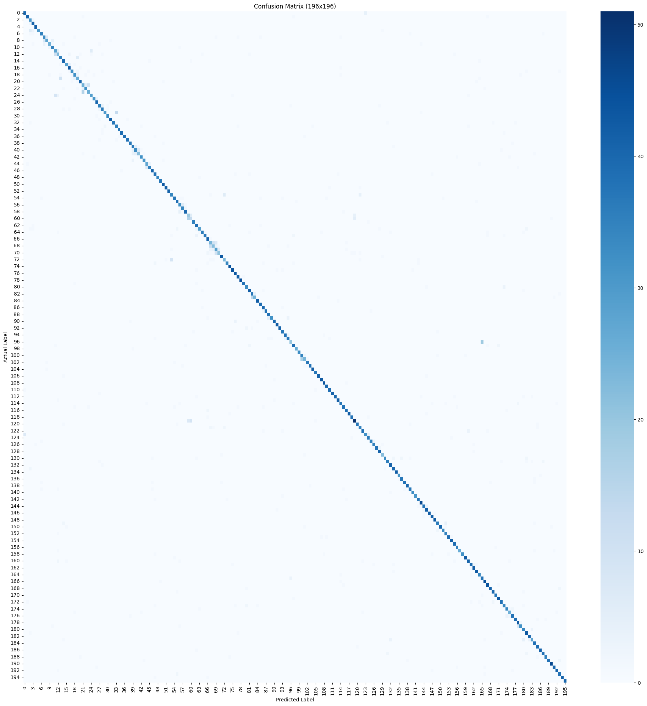
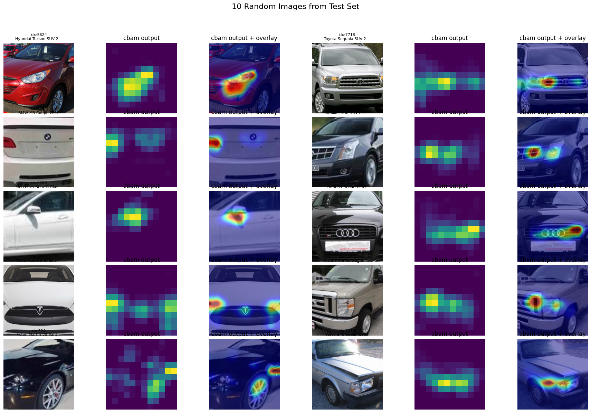
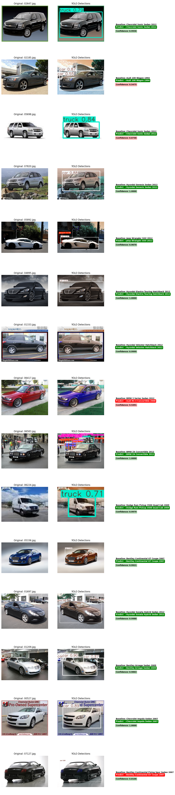

# Fine-Grained Car Classification with EfficientNet-B4 & CBAM

This project implements a Fine-Grained Visual Categorization (FGVC) system to identify 196 different car models using the Stanford Cars Dataset. It employs an EfficientNet-B4 architecture enhanced with a Convolutional Block Attention Module (CBAM) and utilizes bounding box annotations for improved training focus. The repository also includes a demonstration of an inference pipeline integrating YOLO for object detection prior to fine-grained classification.

## Key Features

*   **Dataset:** Stanford Cars Dataset (196 classes).
*   **Dataset Size:** Train dataset has 8143 images and test dataset has 8040 images.
*   **Model:** EfficientNet-B4 pre-trained on ImageNet, fine-tuned for car classification.
*   **Number of Model Parameters:** 18,702,958
*   **Attention Mechanism:** Convolutional Block Attention Module (CBAM) integrated to enhance feature representation by focusing on important channel and spatial features.
*   **Bounding Box Cropping:** Utilizes `anno_train.csv` and `anno_test.csv` to crop images to the car, removing background noise.
*   **Data Augmentation:** Standard techniques like RandomCrop, HorizontalFlip, and ColorJitter.
*   **Evaluation:** Comprehensive metrics including accuracy, precision, recall, F1-score, and confusion matrix.
*   **Visualization:**
    *   Class Activation Maps (CAMs) using SmoothGradCAMpp to understand model interpretability.
    *   End-to-end inference pipeline demo with YOLO for car detection followed by FGVC.
*   **Framework:** PyTorch.

## Model Architecture

The core model is an EfficientNet-B4. A CBAM module is inserted after its main feature extraction layers and before the final average pooling and classification head. This allows the model to adaptively refine feature maps, emphasizing salient information for distinguishing between similar car models.

The model was trained with an input size of `380x380`.

## Technologies Used

*   PyTorch & TorchVision
*   Pandas
*   Scikit-learn
*   Matplotlib
*   Tqdm
*   Pillow
*   Ultralytics (for YOLO)
*   TorchCAM (for CAM visualization)

## Setup & Installation

1.  **Clone the repository (if applicable) or download the notebook.**
2.  **Install dependencies:**
    ```bash
    pip install torch torchvision torchaudio
    pip install pandas scikit-learn matplotlib tqdm pillow ultralytics torchcam
    ```
3.  **Download Dataset:**
    The notebook contains commands to download the Stanford Cars dataset from Kaggle (`jutrera/stanford-car-dataset-by-classes-folder`).
    ```python
    # !wget https://www.kaggle.com/api/v1/datasets/download/jutrera/stanford-car-dataset-by-classes-folder
    # !mv stanford-car-dataset-by-classes-folder stanford-car-dataset-by-classes-folder.zip
    # !unzip -q stanford-car-dataset-by-classes-folder.zip -d stanford-car-dataset-by-classes-folder
    ```
    Adjust paths in the notebook configuration if your dataset is stored elsewhere.

## Usage

The project is primarily contained within the Jupyter Notebook (`.ipynb` file).
1.  Open the notebook in a Jupyter environment (Jupyter Lab, Jupyter Notebook, Google Colab, VS Code).
2.  Ensure the dataset paths and other configurations at the beginning of the notebook are correctly set.
3.  Run the cells sequentially to:
    *   Prepare the data (including bounding box cropping).
    *   Define the model architecture.
    *   Train the model (or load pre-trained weights if `MODEL_SAVE_PATH` points to an existing model).
    *   Evaluate the model on the test set.
    *   Visualize CAMs.
    *   Run the YOLO + FGVC inference demo.

The trained model weights are saved to `car_model_efficientnet_b4_cbam.pth` by default.

## Results & Visualizations

### Training Performance

The model was trained for approximately 18 epochs (out of a planned 25), achieving its best validation accuracy at that point.
*   **Best Validation Accuracy:** Achieved around epoch 17 (refer to plot).
*   **Training & Validation Loss/Accuracy:**

    

### Test Set Evaluation

*   **Overall Test Accuracy:** 88.51%
    *(You can replace this with the exact number from your notebook output)*
*   **Classification Report Highlights:**
    *   Weighted Avg Precision: 0.8891
    *   Weighted Avg Recall: 0.8851
    *   Weighted Avg F1-Score: 0.8847
    *   Macro Avg F1-Score: 0.8840

*   **Confusion Matrix:**
    A 196x196 confusion matrix visualizes per-class performance.

    

### Class Activation Maps (CAMs)

SmoothGradCAMpp visualizations highlight the image regions the model focuses on, specifically looking at the output of the CBAM layer.



### YOLO + FGVC Inference Demo

This section demonstrates a practical pipeline where YOLO first detects cars in an image, and then our trained FGVC model classifies the detected car.



---

### Observations

The current bounding box cropping method can lead to errors if multiple cars are present in the crop. Transitioning to image segmentation to isolate the primary vehicle before classification offers a promising path to improved model accuracy by providing cleaner, more focused input.
